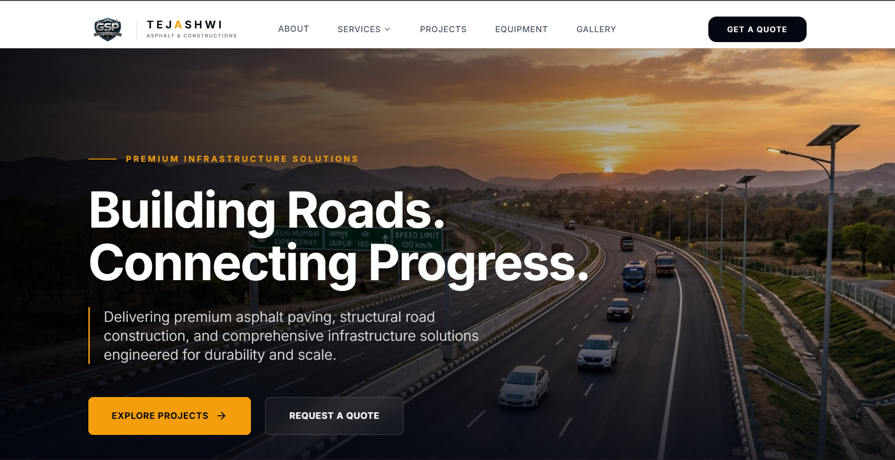
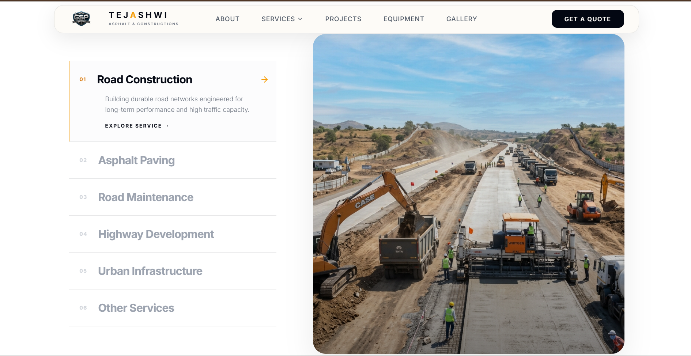
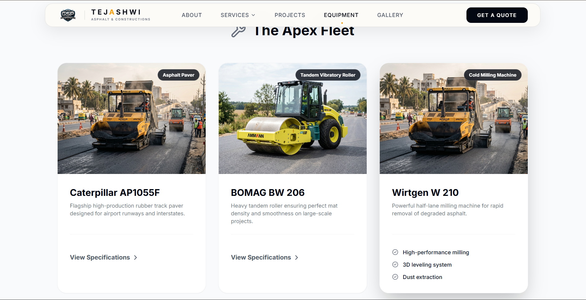
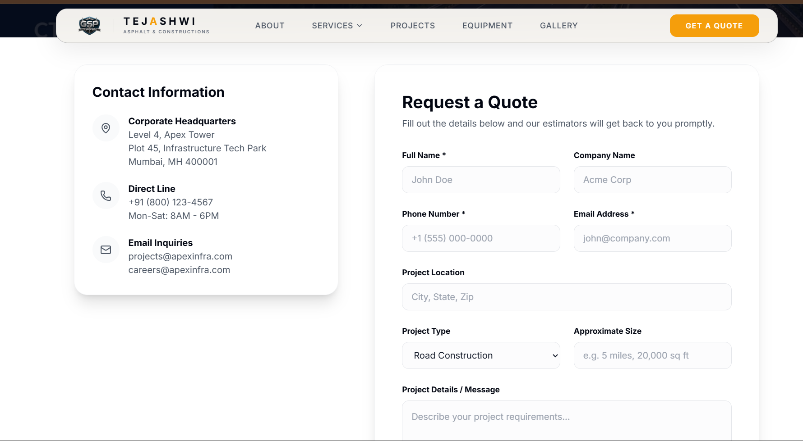
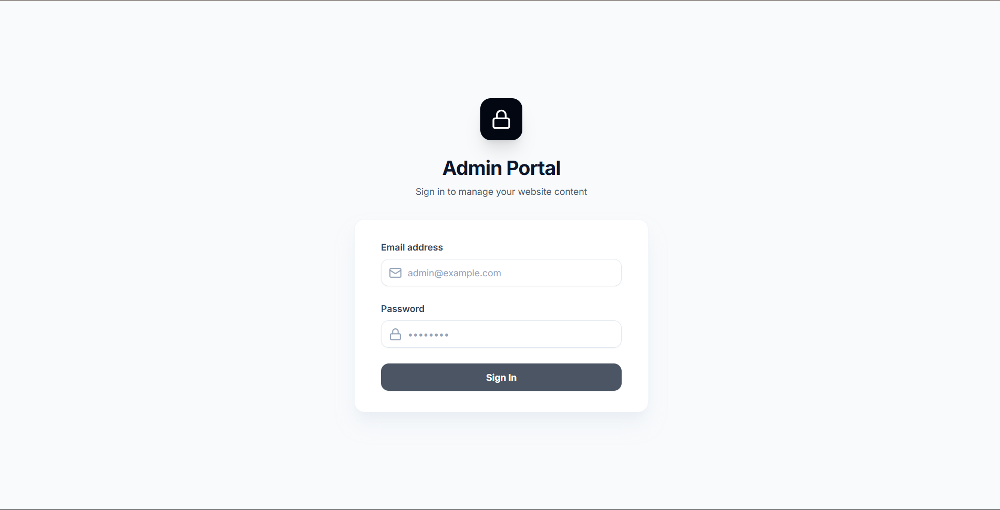
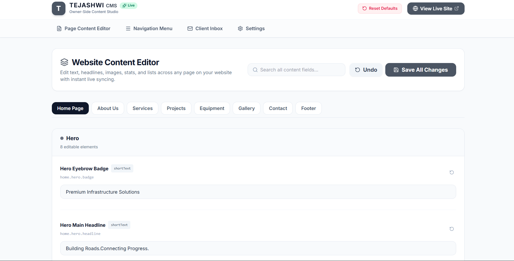
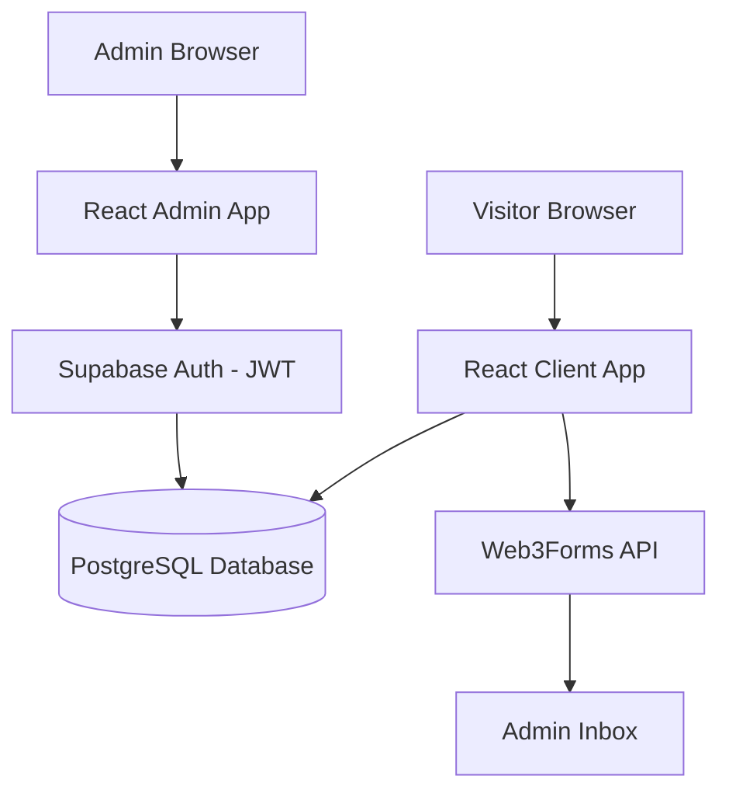

<div align="center">

# 🚧 Tejashwi Asphalt & Constructions 🚧

### A premium, high-performance website and full-stack Content Management System for an industry-leading construction firm.

<br/>

[](https://gsp-construction.vercel.app/)
[](https://github.com/Nishanth2434/Tejeshwi-Asphalt/stargazers)
[](LICENSE)

[](https://react.dev)
[](https://typescriptlang.org)
[](https://tailwindcss.com)
[](https://postgresql.org)
[](#-contributing)

</div>

---

## 🌐 Live Demo

<div align="center">

### Try the live website here 👇

<a href="https://gsp-construction.vercel.app/">
  
</a>

<br/><br/>

| Area                   | URL                                                  |
| :--------------------- | :--------------------------------------------------- |
| 🚧 Client Website      | https://gsp-construction.vercel.app                  |
| 🛡️ Admin CMS Login     | https://gsp-construction.vercel.app/admin/login      |

</div>

---

## 📸 A Look Inside — Website Trailer

<div align="center">

<b>🏠 Home — dynamic hero banner, services, and live company stats</b>



</div>

<table>
  <tr>
    <td width="50%"><b>🏢 Services Page</b><br/></td>
    <td width="50%"><b>🚜 Heavy Equipment</b><br/></td>
  </tr>
  <tr>
    <td width="50%"><b>📞 Contact & Leads</b><br/></td>
    <td width="50%"><b>🛡️ Admin Login</b><br/></td>
  </tr>
</table>

<div align="center">

<b>🛡️ Admin CMS — Edit content, navigation, and manage leads in real-time</b>



</div>

---

## ✨ Features

<table>
  <tr>
    <td width="33%">
      <h3>🔐 Authentication</h3>
      Email / password secure sessions using Supabase Auth to protect the Admin CMS.
    </td>
    <td width="33%">
      <h3>📝 Live Content Editor</h3>
      Admins can update text, images, and services globally without touching a line of code.
    </td>
    <td width="33%">
      <h3>🛡️ Admin Dashboard</h3>
      A private portal dedicated to managing the entire public-facing website.
    </td>
  </tr>
  <tr>
    <td>
      <h3>🧭 Dynamic Navigation</h3>
      Build, reorder, and hide navigation menu items directly from the CMS settings.
    </td>
    <td>
      <h3>📥 Client Inbox</h3>
      Collect leads via Web3Forms directly into the admin dashboard inbox.
    </td>
    <td>
      <h3>📱 Responsive Design</h3>
      Mobile-first layouts — beautiful fluid grids adapt seamlessly to phones and tablets.
    </td>
  </tr>
  <tr>
    <td>
      <h3>✨ Fluid Animations</h3>
      Premium aesthetic powered by Framer Motion for scroll-triggered fades and pops.
    </td>
    <td>
      <h3>🖼️ Advanced Galleries</h3>
      Filterable project portfolios and heavy equipment showcases.
    </td>
    <td>
      <h3>⏪ Factory Reset</h3>
      A dedicated safety switch to instantly restore all database defaults if a mistake is made.
    </td>
  </tr>
</table>

<details>
<summary><b>🤖 Smart extras</b></summary>

- **Real-time CMS Sync** — Edits made in the dashboard instantly reflect on the client site.
- **Batched Save System** — Changes are held locally and saved globally via a batch-upsert to minimize database calls.
- **Undo Capability** — A local snapshot allows admins to instantly undo unsaved CMS edits.
- **Account Security** — Changing passwords requires verification of the previous password for maximum security.

</details>

---

## 🧰 Tech Stack

| Layer               | Technology                                                |
| :------------------ | :-------------------------------------------------------- |
| **Frontend**        | React 19 + Vite (Client and Admin portals)                |
| **Database**        | PostgreSQL (Supabase) + Row Level Security                |
| **Authentication**  | Supabase Auth — email/password, JWT sessions              |
| **Hosting**         | Vercel (edge deployment + CDN)                            |
| **Version Control** | Git + GitHub                                              |
| **UI Framework**    | Tailwind CSS v3                                           |
| **Icons**           | Lucide React                                              |
| **Animations**      | Framer Motion                                             |
| **Form Handling**   | Web3Forms (for contact submissions)                       |

---

## 🏗️ Architecture

The app is built as an NPM Workspace Monorepo containing two separated apps (`client` and `admin`). The frontend is statically deployed via Vite, and pulls all layout and content data dynamically from the Supabase PostgreSQL database.

```text
Frontend (React + Vite SPA)
        ↓
Supabase JS Client
        ↓
Authentication (JWT session for Admin)
        ↓
Database (PostgreSQL content & navigation tables)
```



---

## 📁 Project Structure

```text
Tejeshwi-Asphalt/
├── package.json (Workspace Root)
├── apps/
│   ├── client/                 # Public Website App
│   │   ├── src/
│   │   │   ├── components/     # Reusable UI & Layouts
│   │   │   ├── pages/          # Home, About, Services, Projects
│   │   │   ├── lib/            # Supabase fetchers & store
│   │   │   └── assets/         # Images, CSS
│   ├── admin/                  # Secure CMS Dashboard App
│   │   ├── src/
│   │   │   ├── components/     # CMS UI, Layouts
│   │   │   ├── pages/          # Content Editor, Navigation Editor, Settings
│   │   │   ├── lib/            # AuthContext, ProtectedRoute, CMS Logic
│   │   │   └── assets/         # CSS
├── screenshots/                # README images
```

---

## 🚀 Performance

- ⚡ **Fast loading** - Optimized Vite bundling and aggressive code minification.
- 📱 **Responsive** - Fluid grid layouts, no layout shift between breakpoints.
- 🧩 **Component Modularity** - Reusable UI components.
- 🖼️ **Optimized Assets** - Compressed background images and web-safe SVGs.

---

## 🔒 Security

| Control                   | Implementation                                                                    |
| :------------------------ | :-------------------------------------------------------------------------------- |
| 🔑 **JWT authentication** | Signed, expiring session tokens attached to Admin API calls.                      |
| 🛡️ **Protected routes**   | Admin CMS is gated client-side using React Auth Providers.                        |
| 🧱 **Row Level Security** | Supabase database tables restrict write-access to authenticated admins only.      |
| 🔒 **HTTPS ready**        | TLS everywhere, secure cookies in production via Vercel.                          |

---

## 📱 Responsive Design

| Device         | Breakpoint   | Experience                                                                |
| :------------- | :----------- | :------------------------------------------------------------------------ |
| 💻 **Desktop** | > 1024px     | Full mega-menus, multi-column bento grids, and side-by-side CMS layouts.  |
| 📱 **Tablet**  | 768 - 1023px | Two-column layouts, condensed navigation bars.                            |
| 🤳 **Mobile**  | < 768px      | Stacked cards, hamburger menus, full-width inputs and action buttons.     |

---

## 🤝 Contributing

Contributions make the open-source community amazing. Every PR is welcome!

<details open>
<summary><b>Contribution steps</b></summary>

1. **Fork** the repository
2. **Create a branch** - `git checkout -b feature/amazing-feature`
3. **Commit your changes** - `git commit -m "feat: add amazing feature"`
4. **Push the branch** - `git push origin feature/amazing-feature`
5. **Open a Pull Request** describing what changed and why

</details>

---

## 📄 License

Distributed under the **MIT License**.

---

## 👨‍💻 Author

<table>
  <tr>
    <td align="center" width="180">
      <br/>
      <b>NISHANTH B</b><br/>
      <sub>Full-Stack Developer</sub>
    </td>
    <td>
      <p>Built the Tejashwi Asphalt website end-to-end - design system, frontend client, database schema and custom Admin CMS.</p>
      <a href="https://linkedin.com/in/your-profile"></a>
      <a href="https://github.com/Nishanth2434"></a>
    </td>
  </tr>
</table>

---

<div align="center">

Made with ❤️ by **NISHANTH B**

<a href="#-features"><b>Features</b></a> •
<a href="#-installation--local-development"><b>Install</b></a>

<sub>Tejashwi Asphalt & Constructions - Building the future, today.</sub>

</div>
